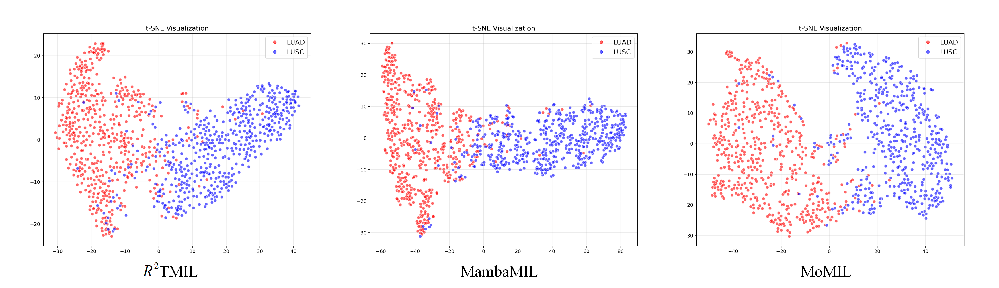

# A Scalable Multiple Instance Learning Framework for Computational Pathology
Continuous updating.

The following sections provide additional details on MoMIL:
* [A. Additional Method Detail](#a-additional-method-detail)
* [B. Datasets Descript](#b-datasets-descript)
* [C. Additional Experiments Detail](#c-additional-experiments-detail)

## A. Additional Method Detail
#### Figure 1. A lightweight feature fusion block.

## B. Datasets Descript
The details of all datasets are shown in Table 1. Each dataset contains WSIs of different sizes.
#### Table 1. Details of all datasets.
|| BRACS |TCGA-NSCLC |CAMELYON-16|LUAD|LUSC|
| --- | --- | --- | --- | --- | --- |
|Sample| 537|1053 | 395 |541|512|
|Min Image Size|17135 $\times$ 11733| 10000 $\times$ 4617 |45056 $\times$ 35840|10000 $\times$ 4617|7995 $\times$ 7522|
|Max Image Size|181272 $\times$ 88334|191352 $\times$ 97078 |217088 $\times$ 111104|191352 $\times$ 97078|193223 $\times$ 90994|
|Min Bag Size|46| 35 |40 |35|41|
|Max Bag Size|7728 | 11747 |11221 |11747|11133|
### Cancer Diagnosis and Sub-typing Datasets
#### 1. BRACS
BRACS is a breast cancer subtyping dataset containing 537 WSIs, categorized into seven subtypes: 40 normal (glandular tissue without lesions) WSIs, 145 pathologically benign (PB) WSIs, 70 usual ductal hyperplasia (UDH) WSIs, 41 flat epithelial atypical hyperplasia (FEA) WSIs, 48 atypical ductal hyperplasia (ADH) WSIs, 61 ductal carcinoma in situ (DCIS) WSIs, and 132 invasive carcinoma (IC) WSIs.
#### 2. TCGA-NSCLC
TCGA-NSCLC is a lung cancer subtyping dataset derived from The Cancer Genome Atlas (TCGA), comprising 512 lung squamous cell carcinoma (LUSC) WSIs and 541 lung adenocarcinoma (LUAD) WSIs.
#### 3. CAMELYON-16
CAMELYON-16 is a WSI dataset designed for the diagnosis of breast cancer metastasis. It includes 395 WSIs, consisting of 236 normal WSIs and 159 tumor WSIs.
### Survival Prediction Datasets
#### 1. TCGA-LUAD
TCGA-LUAD, derived from TCGA, is a dataset for cancer survival prediction. It includes 541 LUAD cases, each with associated survival time and censoring indicators.
#### 2. TCGA-LUSC
TCGA-LUSC, also from TCGA, is another dataset for cancer survival prediction. It contains 512 LUSC cases, with corresponding survival time and censoring indicators.

## C. Additional Experiments Detail
### C.1. Cancer Diagnosis Results of CAMELYON-16
#### Table 2. Cancer diagnosis results of CAMELYON-16.
| Method       | AUC          | ACC          | F1 Score     |
|--------------|--------------|--------------|--------------|
| Max Pooling  | 0.7748±0.103 | 0.7375±0.103 | 0.6450±0.104 |
| Mean Pooling | 0.7437±0.037 | 0.7042±0.027 | 0.5604±0.045 |
| ABMIL        | 0.8073±0.047 | 0.7564±0.052 | 0.6624±0.063 |
| CLAM         | 0.8097±0.045 | 0.7470±0.027 | 0.6592±0.054 |
| TransMIL     | 0.8159±0.092 | 0.7631±0.062 | 0.6641±0.125 |
| S4MIL        | 0.8053±0.069 | 0.7511±0.050 | 0.6467±0.095 |
| MambaMIL     | 0.7309±0.111 | 0.6923±0.151 | 0.5834±0.136 |
| $R^2$ TMIL       | 0.8104±0.047 | 0.7621±0.044 | 0.6635±0.045 |
| LongMIL      | 0.8080±0.039 | 0.7578±0.067 | 0.6565±0.098 |
| Our Model    | **0.8196±0.038** | **0.7668±0.024** | **0.6703±0.041** |

Table 2 presents the cancer diagnosis performance of various MIL methods on the CAMELYON-16 dataset. The results indicate that our proposed MoMIL outperforms all other methods across all evaluation metrics. Specifically, MoMIL surpasses the second-best method by 0.0037, 0.0047, and 0.0068 in terms of AUC, ACC, and F1 score, respectively.
### C.2. Results of feature fusion block using different activation functions.
#### Table 3. Comparative experiments of feature fusion block on the TCGA-NSCLC dataset.
| Method                  | AUC          | ACC          | F1 Score     |
|-------------------------|--------------|--------------|--------------|
| w/o activation function | 0.9218±0.036 | 0.8534±0.039 | 0.8451±0.039 |
| ELU                     | 0.9265±0.027 | 0.8517±0.042 | 0.8472±0.041 |
| GELU                    | 0.9298±0.039 | 0.8572±0.056 | 0.8517±0.060 |
| ReLU                    | 0.9248±0.042 | 0.8606±0.049 | 0.8534±0.056 |
| SiLU                    | 0.9265±0.038 | 0.8672±0.044 | 0.8611±0.049 |
| Tanh                    | 0.9359±0.027 | 0.8613±0.042 | 0.8560±0.039 |
| Adaptive pool           | 0.9270±0.032 | 0.8614±0.039 | **0.8612±0.041** |
| Simple attention        | 0.8896±0.034 | 0.7943±0.047 | 0.7660±0.057 |
| Dynamic kernel          | 0.9323±0.026 | 0.8585±0.036 | 0.8461±0.038 |
| Hybrid fusion           | 0.9380±0.038 | 0.8601±0.050 | 0.8597±0.059 |
| Our Model(Sigmod)       | **0.9461±0.023** | **0.8684±0.040** | 0.8585±0.047 |

Table 3 presents a comparative analysis of various fusion strategies, further demonstrating the advantages of our approach. We systematically evaluated alternative activation functions and existing fusion methods, consistently finding that our proposed fusion strategy outperforms others in computational pathology (CPath). Notably, the Sigmoid and Tanh activation functions achieved the highest AUC scores—0.9461 for Sigmoid and 0.9359 for Tanh. We attribute this improvement to the fact that symmetric nonlinear activations better preserve the interplay between positive and negative features in histopathological patterns. In contrast, activation functions such as ReLU discard negative activations, compressing information into a unipolar range and potentially limiting feature expressiveness. Moreover, compared to Tanh, the smaller output range of Sigmoid provides meaningful advantages in maintaining stable learning dynamics for WSI sequences. Several widely used fusion architectures, including adaptive pooling, simple attention, dynamic kernel, and hybrid fusion, were also examined. To reduce computational overhead, we streamlined these methods to ensure their feasibility for WSI analysis. Among them, hybrid fusion—which incorporates pointwise and depthwise separable convolutions—demonstrated the best performance. However, it still fell significantly short compared to our proposed fusion strategy. Experimental results indicate that, despite its structural simplicity, our fusion module effectively integrates multi-order features, leading to superior overall performance. Detailed implementations of the different fusion strategies are available on [Fusion](fusion/).
### C.3. Visualization.
#### Figure 2. The tSNE visualization of features on the TCGA-NSCLC dataset.

As illustrated in Figure 2, the t-SNE visualization results from our experiments demonstrate that the proposed model achieves superior separability between LUAD and LUSC slides compared to both $R^2$ TMIL and MambaMIL frameworks. Specifically, the distinct clustering patterns observed in our visualization highlight an enhanced discriminative capability in feature representation learning, with substantially fewer misclassified samples along the interface regions. This improved topological organization in the latent space suggests that our architecture better preserves pathological discriminative features during slide-level aggregation. Notably, when compared with another SSM-based approach, MambaMIL, our model exhibits significant qualitative improvements in both inter-class separation and intra-class compactness. This performance gap underscores the effectiveness of our novel structural modifications in mitigating the feature homogenization issue commonly encountered in sequential state-space modeling. Furthermore, the reduced misclassification rate implies greater robustness against histological ambiguities and staining variations, which is particularly critical for clinical diagnostic applications where accurate cancer subtyping directly influences therapeutic decision-making. These visualization results validate that our method surpasses existing MIL frameworks in capturing pathologically relevant morphological patterns while maintaining strong discriminative power across heterogeneous WSI datasets.
