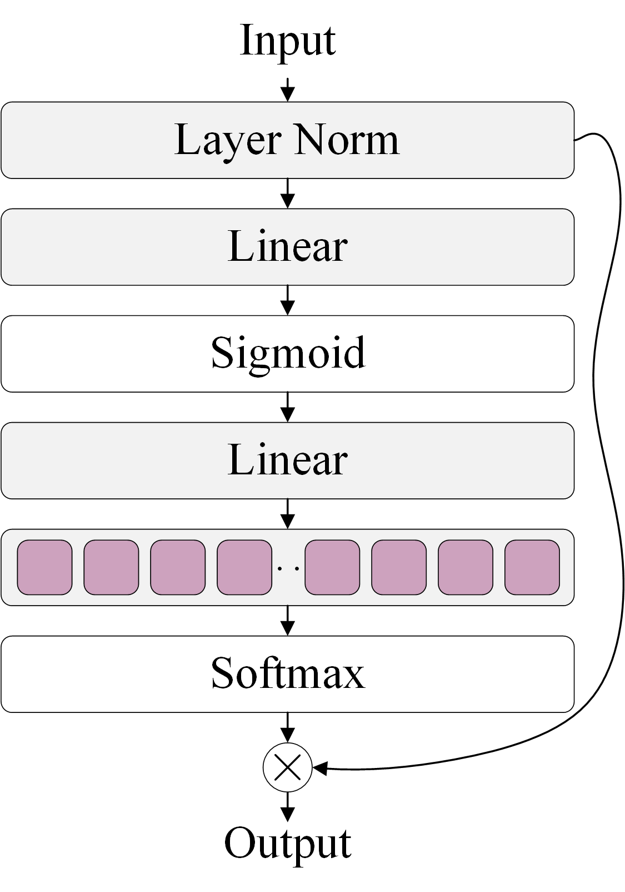

# A Scalable Multiple Instance Learning Framework for Computational Pathology
Continuous updating.
## A. Additional Method Detail
### Figure 1. A lightweight feature fusion block.

## B. Dataset Descript
The information of all datasets is shown in Table 1, and each dataset contains WSIs of different sizes.
### Table 1. Details of all datasets.
|| BRACS |TCGA-NSCLC |CAMELYON-16|
| --- | --- | --- | --- |
|Sample| 537|1053 | 395 |
|Min Image Size|17135 $\times$ 11733| 10000 $\times$ 4617 |45056 $\times$ 35840|
|Max Image Size|181272 $\times$ 88334|191352 $\times$ 97078 |217088 $\times$ 111104|
|Min Bag Size|46| 35 |40 |
|Max Bag Size|7728 | 11747 |11221 |
### Cancer Diagnosis and Sub-typing Datasets
#### 1.BRACS
BRACS is a WSI dataset for breast cancer sub-typing that contains a total of 537 WSIs. It has seven subtypes, specifically: 40 normal (glandular tissue samples without lesions) WSIs, 145 pathologically benign (PB) WSIs, 70 ordinary ductal hyperplasia (UDH) WSIs, 41 flat epithelial atypical hyperplasia (FEA) WSIs, 48 atypical ductal hyperplasia (ADH) WSIs, 61 ductal carcinoma in situ (DCIS) WSIs, and 132 invasive carcinoma (IC) WSIs.
#### 2.TCGA-NSCLC
TCGA-NSCLC derived from The Cancer Genome Atlas (TCGA) is a WSI dataset for lun cancer sub-typing. It includes two subtypes: 512 lung squamous cell carcinoma (LUSC) WSIs and 541 lung adenocarcinoma (LUAD) WSIs.
#### 3.CAMELYON-16
CAMELYON-16 is a WSI dataset for the diagnosis of breast cancer metastasis. A total of 395 WSIs are included. It contains 236 normal WSIs, 159 tumor WSIs.
### Survival Prediction Datasets
#### TCGA-LUAD and TCGA-LUSC
